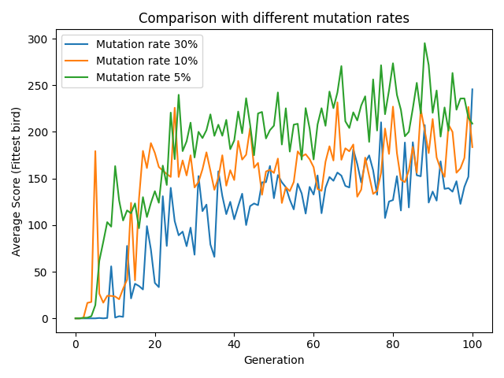
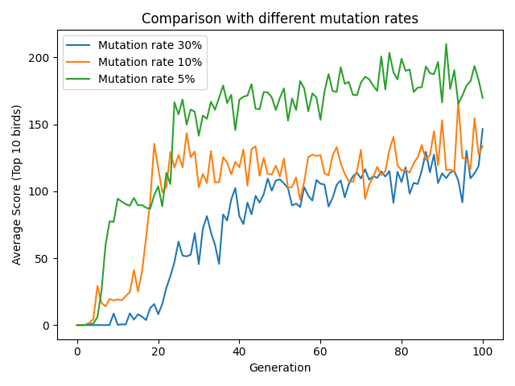
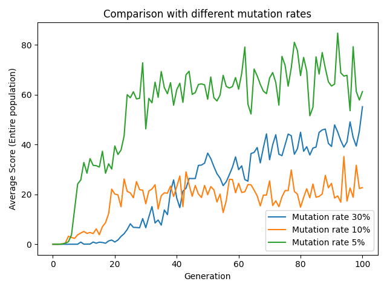

# NE-flappybird

This project is an implementation of neuro-evolution techniques using pytorch to make an AI agent that is able to play Flappybird in "human" level or better.

This project was done entirely for fun, and was included in a seminar talk I presented on the topic of evolution and games: [link to the presentation](https://drive.google.com/file/d/1d-3R-Rxr_p3sAPNx1vfStFdQUYGagXds/view?usp=sharing).

## The NN architecture (for the non-rgb version)

The observation or input is the delta x and y to the next tunnel from the current position of the bird.

After the input layer we use a sigmoid activation, and after the hidden layer we have a softmax activation, thus using the argmax on the output vector gives us the action to be taken.

Note that we use no bias thus we have a total of 16 weights to learn.

## The genome
 

 

The bird genome is just the weights of the NN.

We consider the genome/DNA of the bird as 2 sequences: the first set of weights is w1-w8, the weights between the input layer and the hidden layer.
The  second set are the weights w9-w16, the weights from the hidden layer to the output.

The genome is used using this structure in the evolution operators.

## The Selection operator

We just used a simple tournament selection, keeping the top 10 fittest birds, where the fitness is computed by evaluating the number actions taken by the bird (averaged over 10 runs).

## The crossover operator

We use a simple crossover taking with prob. of 0.5 the first sets of weights (input->hidden) from a certain parent, the same for the second set (hidden->output)

## The mutation operator

We just draw random numbers in the range of [-1,1] and we add these numbers to each weight in the DNA of the bird (16 weights overall).

## The population

The initial population size is 100 birds, and since we use a cartesian product for the crossover, with 10 parents (the same bird will also be mated with itself to produce an offspring) we get that the population size stays 10*10=100.

## Replay of selected generetions during evolution
  Generetion 2 |  Generetion 5 | Generetion 67  |  Generetion 88 - replay speed x2|
|:---:|:---:|:---:|:---:|
|   |   |   |   |

## Plots of results using different mutation rates

### Average score for top bird in population generations 0-100

### Average score for selected parents (top 10 birds) in population generations 0-100

### Average score for entire population generations 0-100
